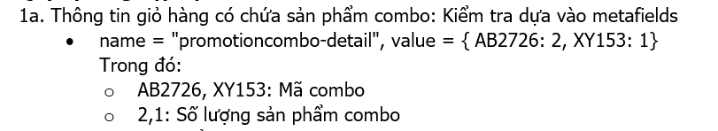
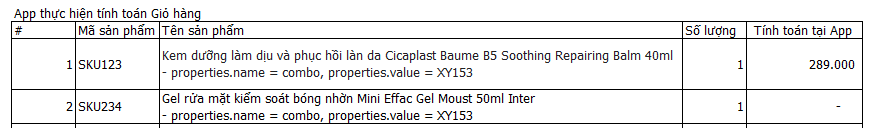

# Thông tin combo trong cart

## Attribute, Property prefix
* app prefix: `PE`
* buy x get y prefix: `PE-buy-x-get-y`
* combo prefix: `PE-combo`

## Property trong sản phẩm ảo
* Dùng để FE trao đổi thông tin với App:
  * Thêm combo
  * Cập nhật số lượng
  * Xóa combo
* User không thấy, không cần dễ đọc
* Cần dễ thay đổi cấu trúc, bổ sung field

* Ví dụ
  * cần set 2 combo với thông tin sau:
    ```json
    { "code": "COMBO_1A_2B", "quantity":1 }

    { "code": "COMBO_1A_2B_3C", "quantity":2 }
    ```

  * Quy định hiện tại:
    ```json
    {
      "properties": {
        "promotioncombo-add": "+COMBO_1A_2B"
      }
    }
    ```

  * Đề nghị đổi thành:
    ```json
    // data
    {
      "properties": {
        "PE-combo-set": {
          "COMBO_1A_2B": 1,
          "COMBO_1A_2B_3C": 2
        }
      }
    }
    // === chuyển sang string ==>
    {
      "properties": {
        "PE-combo-set": "{\"COMBO_1A_2B\":1,\"COMBO_1A_2B_3C\":2}"
      }
    }
    ```

### Attribute
* Thông tin bắt buộc:
  * combo code
  * combo quantity

* Ví dụ
  * 2 combo với thông tin sau:
    ```json
    { "code": "COMBO_1A_2B", "title":"Combo 1A va 2B","quantity":1 }

    { "code": "COMBO_1A_2B_3C", "title":"Combo 1A va 2B và 3C","quantity":2 }
    ```

  * Quy định hiện tại: chỉ add được 1 COMBO_1A_2B
    * FS: quy định 2 kiểu:

      * 
      * 
    
    ```json
    // data
    {
      "attributes": {
        "promotioncombo-detail": {
          "COMBO_1A_2B": 1,
          "COMBO_1A_2B_3C": 2
        }
      }
    }
    // === chuyển sang string ==>
    {
      "attributes": {
        "promotioncombo-detail": "{\"COMBO_1A_2B\":1,\"COMBO_1A_2B_3C\":2}"
      }
    }
    ```

  * Đề nghị đổi thành:
    ```json
    // data
    {
      "attributes": {
        "PE-combo COMBO_1A_2B": {
          "title": "Combo 1A va 2B",
          "quantity": 1
        },
        "PE-combo COMBO_1A_2B_3C": {
          "title": "Combo 1A va 2B và 3C",
          "quantity": 2
        }
      }
    }
    // === chuyển sang string ==>
    {
      "attributes": {
        "PE-combo-detail COMBO_1A_2B": "{\"title\":\"Combo 1A va 2B\",\"quantity\":1}",
        "PE-combo-detail COMBO_1A_2B_3C": "{\"title\":\"Combo 1A va 2B và 3C\",\"quantity\":2}"
      }
    }
    // hoặc dễ đọc
    {
      "attributes": {
        "PE-combo-detail {combo.code}": "{combo.quantity}",
      }
    }

    {
      "attributes": {
        "PE-combo-detail COMBO_1A_2B": "1",
        "PE-combo-detail COMBO_1A_2B_3C": "2"
      }
    }
    ```

### Property combo item
* Thông tin bắt buộc:
  * combo code

* Ví dụ
  * 2 combo với thông tin sau:
    ```json
    { "code": "COMBO_1A_2B", "title":"Combo 1A va 2B","quantity":1 }
    ```

  * Quy định hiện tại:
    * FS
      * .png)
    * Excel Example
      * 
    
    ```json
    // data
    {
      "properties": {
        "promotioncombo-item": "COMBO_1A_2B"
      }
    }
    ```

  * Đề nghị đổi thành:
    ```json
    {
      "properties": {
        "PE-combo-item": "{combo.code} | {combo.title}"
      }
    }

    {
      "properties": {
        "PE-combo-item": "COMBO_1A_2B | Combo 1A va 2B"
      }
    }
    ```